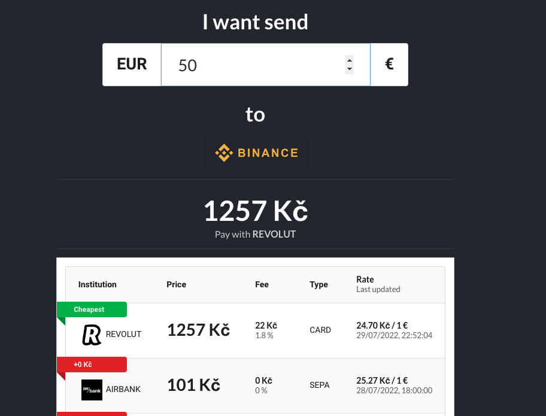

<div id="top"></div>

<!-- PROJECT LOGO -->
<br />
<div align="center">

  <h3 align="center">curzy</h3>

  <p align="center">
    Check how much it cost to buy some crypto.
    <br />
    <a href="https://curzy.herokuapp.com/"><strong>https://curzy.herokuapp.com/</strong></a>
    <br />
    <br />
    <a href="https://github.com/lipelix/curzy/issues">Report Bug</a>
    ·
    <a href="https://github.com/lipelix/curzy/issues">Request Feature</a>
  </p>
</div>


<!-- ABOUT THE PROJECT -->
## About The Project

<!-- [![Product Name Screen Shot][product-screenshot]](assets/app-screen.png) -->

If you are sending some money to crypto exchange there is always some fee. If you do it from your bank account there is some fee. If you do it by card there is some fee. Curzy will agregate this for you. No more counting of fees by yourself. You are welcome.

<p align="right">(<a href="#top">back to top</a>)</p>


### Built and Deploy

This is backend part of its frontend counter-part [curzy-fe](https://github.com/lipelix/curzy-fe). Project is build with express on backend to provide API. It runs workers which regularly check rates with help of [puppeteer](https://github.com/puppeteer/puppeteer). All is deployed on heroku dynos.


<p align="right">(<a href="#top">back to top</a>)</p>


<!-- GETTING STARTED -->
## Getting Started

You can run this project locally (even if it doesn't make much sense :).

### Prequisities

* MongoDb (e.g. free tier on https://www.mongodb.com/atlas/database)
* npm (Node.js)

### Installation

1. Setup MongoDb - prepare host, username and password for connection
1. Clone the repo
   ```sh
   git clone https://github.com/lipelix/curzy.git
   ```
1. Install NPM packages
   ```sh
   npm install
   ```
1. Rename `.env.example` file in root project and fill variables
1. Enter your API in `.env` file
   ```
    MONGO_DB_URI: <host of mongo cluster>
    MONGO_DB_NAME: <database name>
    PORT: <port on which server will run>
   ```
1. Run your app by `npm run dev`

<p align="right">(<a href="#top">back to top</a>)</p>


<!-- USAGE EXAMPLES -->
## Usage

This is very easy. Just open https://curzy.herokuapp.com/ .

<br />



<p align="right">(<a href="#top">back to top</a>)</p>


<!-- ROADMAP -->
## Roadmap

- [x] Deploy project
- [ ] Add Support for automatic deployment
- [ ] Multi-language Support
    - [ ] Czech
    - [x] English
- [ ] Add more banks, payment methods

<p align="right">(<a href="#top">back to top</a>)</p>

<!-- CONTACT -->
## Contact

Libor Váchal - [LinkedIn](https://www.linkedin.com/in/liborvachal/)

Project Link: [https://github.com/lipelix/curzy](https://github.com/lipelix/curzy)

<p align="right">(<a href="#top">back to top</a>)</p>


<!-- ACKNOWLEDGMENTS -->
## Acknowledgments

Usefull links and another things worth to mention.

* [Husky](https://github.com/typicode/husky) - better commits
* [puppeteer](https://github.com/puppeteer/puppeteer) - control your chrome by API
* [Readme template](https://github.com/othneildrew/Best-README-Template)

<p align="right">(<a href="#top">back to top</a>)</p>
