<!-- PROJECT LOGO -->
 

  <h3 align="center">curzy</h3>

  

    Check how much it costs to buy some crypto.
     
    <a href="https://curzy.pages.dev/"><strong>https://curzy.pages.dev/</strong></a>
     
     
    <a href="https://github.com/lipelix/curzy/issues">Report Bug</a>
    ·
    <a href="https://github.com/lipelix/curzy/issues">Request Feature</a>
  

<!-- ABOUT THE PROJECT -->
## About The Project

<!-- [![Product Name Screen Shot][product-screenshot]](assets/app-screen.png) -->

If you are sending some money to a crypto exchange, there is always a fee. If you do it from your bank account, there is a fee. If you do it by card, there is a fee 😞. Curzy will aggregate this for you. No more counting of fees by yourself 🎉. You are welcome.

(<a href="#top">back to top</a>)

### Built and Deploy

 The project is composed of multiple components:
 - Frontend website is a React app deployed on [cloudflare pages](https://pages.cloudflare.com/),
 - API fetching data about rates is built with [cloudflare workers](https://workers.cloudflare.com/),
 - [Atlas MongoDB](https://www.mongodb.com/products/platform/atlas-database) is used as a database to store data about rates,
 - Feeder is a scheduled job which is hosted on [GCP app engine](https://cloud.google.com/appengine?hl=cs) - it scrapes data from institutions and saves it to MongoDB,
 - [Terraform](https://www.terraform.io/) is used to manage infrastructure.

(<a href="#top">back to top</a>)

## Overview

General overview of the project architecture.

```mermaid
flowchart TD
    A["⏰ Feeder"] -- Store data from website --> B[("Database")]
    B -- Query data from database --> C["Curzy API Worker"]
    C -- Fetches data --> D["Website"]
    n1["Revolut"] -- Scrape --> A
    n2["CSOB"] -- Scrape --> A
    n3["Airbank"] -- Scrape --> A
    n1@{ shape: doc}
    n2@{ shape: doc}
    n3@{ shape: doc}
```

(<a href="#top">back to top</a>)

<!-- GETTING STARTED -->
## Getting Started

You can run this project locally (even if it doesn't make much sense :).

### Prerequisites

* Docker with `docker-compose`

### Setup and Run

1. Copy env files, remove `.example` postfix, and fill variables in each sub-project:
   -  `./apps/feeder/.env.example` - feeder
   -  `./workers/curzy-api/.dev.vars.example` - API
   -  `./website/.env.example` - website
2. Run `docker-compose up` - this will spin up a MongoDB instance and the website
3. Run `npm run start --prefix ./workers/curzy-api` to start API
4. Run `npm i --prefix ./apps/feeder` to install dependencies
5. Run `npm run dev --prefix ./apps/feeder` to start feeder

<!-- USAGE EXAMPLES -->
### Usage

1. Initiate the feeder to load some data into the database by visiting http://localhost:8081/jobs/all
2. Open the app in a browser on http://localhost:3000/
3. Check if the API is running on http://localhost:8000/swagger

 

(<a href="#top">back to top</a>)

<!-- ROADMAP -->
## Roadmap

- [x] Deploy project
- [x] Add Support for automatic deployment
- [ ] Multi-language Support
    - [ ] Czech
    - [x] English
- [ ] Support more banks, payment methods

(<a href="#top">back to top</a>)

<!-- CONTACT -->
## Contact

Libor Váchal - [LinkedIn](https://www.linkedin.com/in/liborvachal/)

Project Link: [https://github.com/lipelix/curzy](https://github.com/lipelix/curzy)

(<a href="#top">back to top</a>)

<!-- ACKNOWLEDGMENTS -->
## Acknowledgments

Useful links and other things worth mentioning.

* [Husky](https://github.com/typicode/husky) - better commits
* [puppeteer](https://github.com/puppeteer/puppeteer) - control your chrome by API
* [Readme template](https://github.com/othneildrew/Best-README-Template)

(<a href="#top">back to top</a>)

